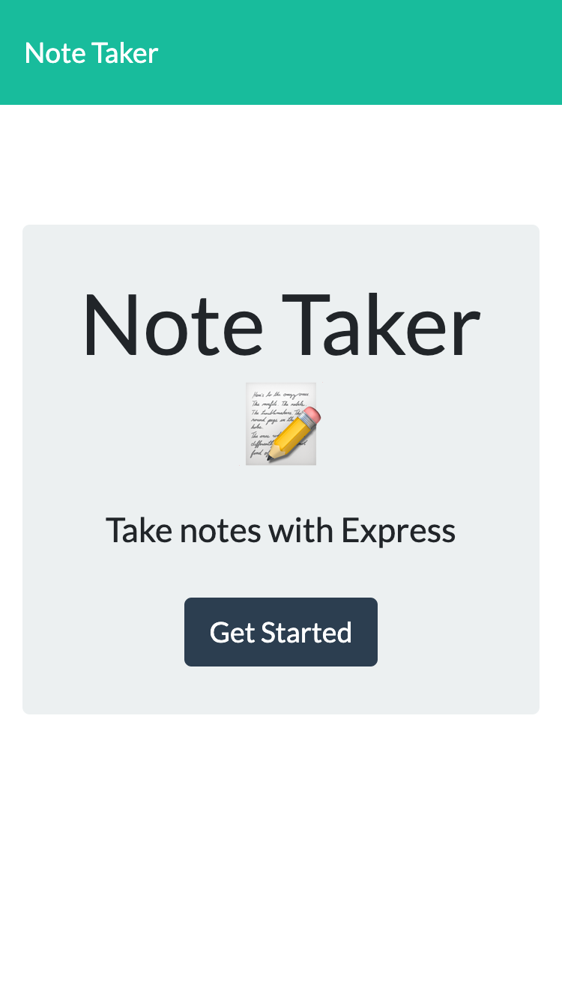
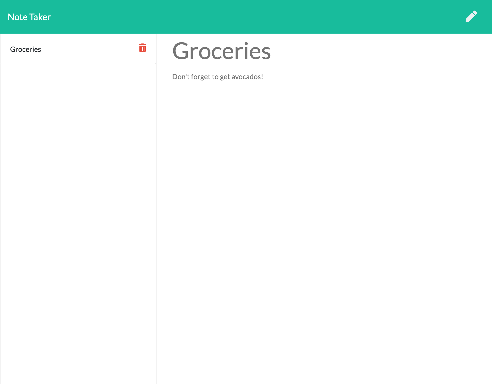
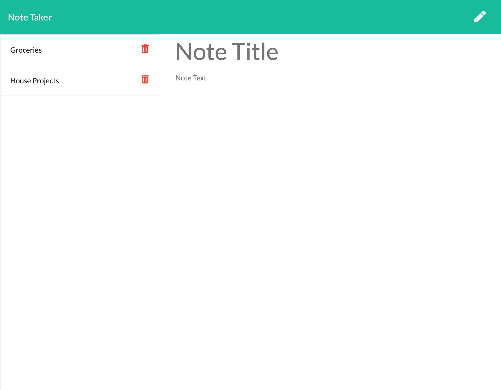

# takeNotes

  [](http://unlicense.org/)

  * [Deployed Site](https://warm-lowlands-22639.herokuapp.com/)

  ## Description
  This is an application that uses Express to create, save, and delete notes to a JSON file on the backend. User input is posted as objects to an API route and pushed to an array that is written in a JSON file. Bootstrap is used to style the user interface and make it responsive at different screen sizes.

  ## Table of Contents
  * [Installation](#installation)
  * [Usage](#usage)
  * [License](#license)
  * [Contributing](#contributing)
  * [Tests](#tests)
  * [Questions](#questions)

  ## Installation
  To install one's own version of takeNotes, after cloning this repository, a user can run ```npm install``` in their terminal to install necessary dependencies. It can then either be run in a browser on a localhost or deployed to a server.

  ## Usage

  * Navigating to the homepage in the browser, the user sees a description of the Note Taker and a button to "Get Started"



Screenshots at 375px, 768px, 1025px

  * Clicking the button will take them to the notes page where any saved note titles will be automatically displayed in a list or "No saved Notes" will display


  * The user can create a new note by filling in the Note Title input and Note Text input. When both of these fields have text, a Save icon will appear that once clicked will save the note to the json file.


  * Clicking on the note title will display the contents of that note



  * If a saved note is currently being displayed, clicking the pencil icon will display input fields to create a new note



  * Clicking on the red trashcan will delete that note by referencing its id number in the json object array


  ## License
  Licensed under the [Unlicense](https://unlicense.org) license.

  ## Contributing
  Please follow the [Contributor Covenant](https://www.contributor-covenant.org) guidelines when contributing to this project.

  ## Tests
  Tests will be a future feature for this application.

  ## Questions
  Please contact me with any questions through my GitHub profile [SEGH](https://github.com/SEGH) or [email](mailto:segh@fastmail.com)
